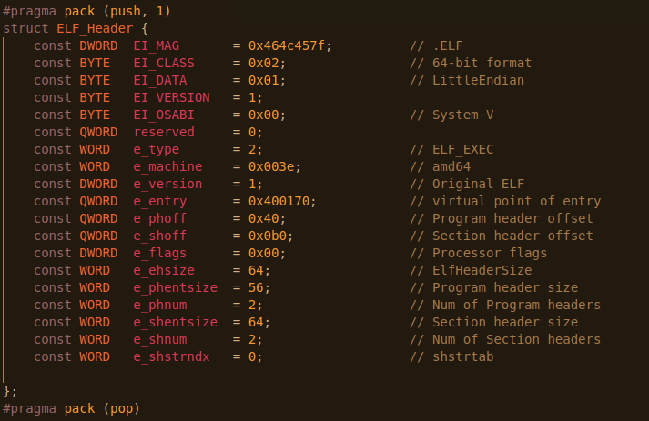

# My own programming language and compiler for it.
## The first stage: building a tree according to the program
Here is an example program on my language:

How does it turn into tree? First, the program is tokenized. 
This happens using the Tocens () function in main.cpp.

This function analyzes the text of the program breaking it into nodes with a certain type. It also fills in the arrays Ids, IdsFunc, IdsParam, that are responsible for local variables, function parameters, and the functions themselves.
This is a tree of this program:

After tranclation by backend_x86.cpp:

## ELF file and compilation to binary code.

You can read about this [here](https://en.wikipedia.org/wiki/Executable_and_Linkable_Format)